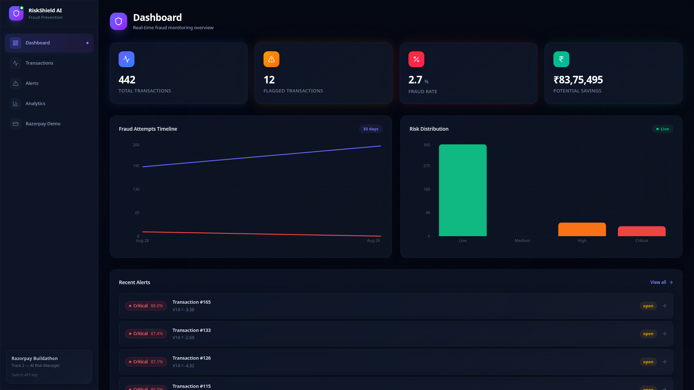
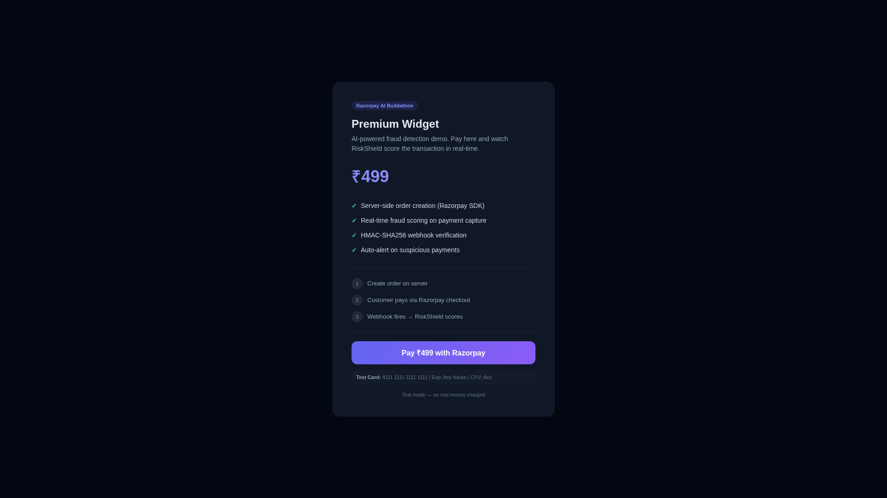
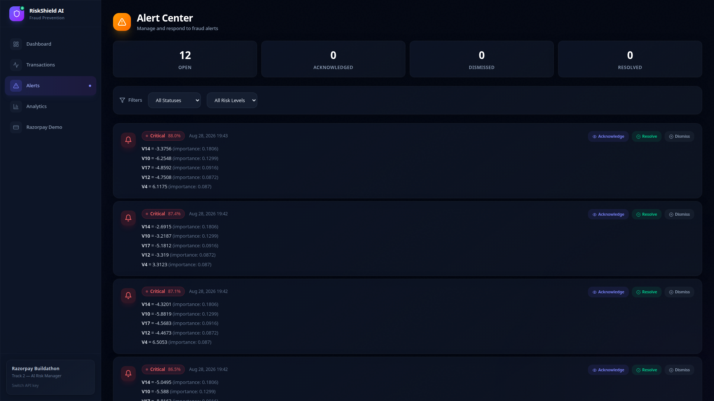
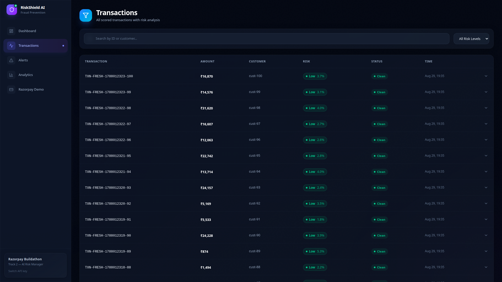
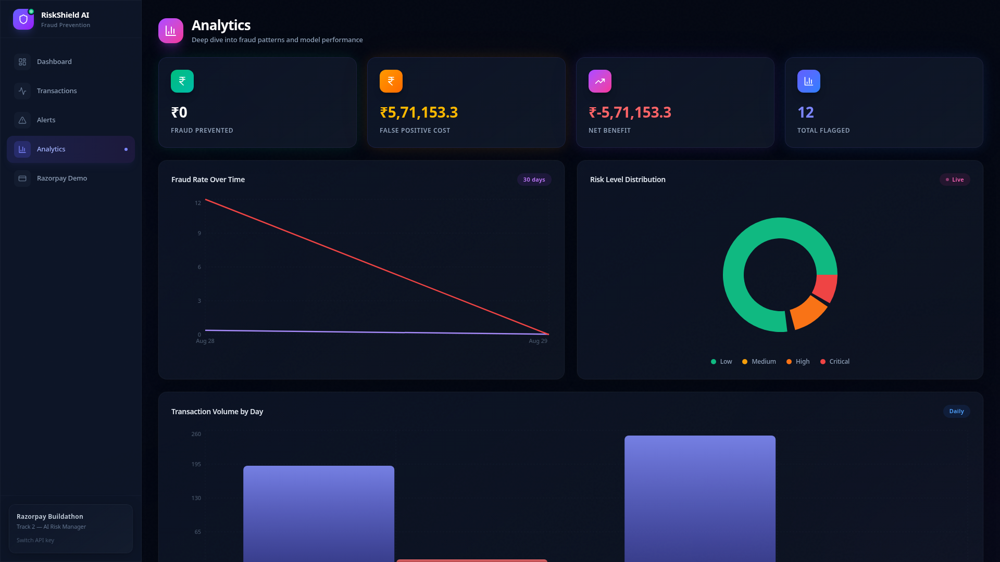
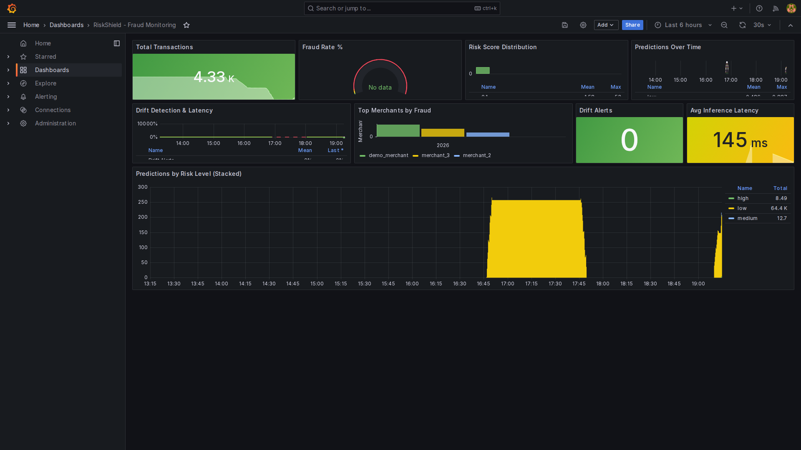
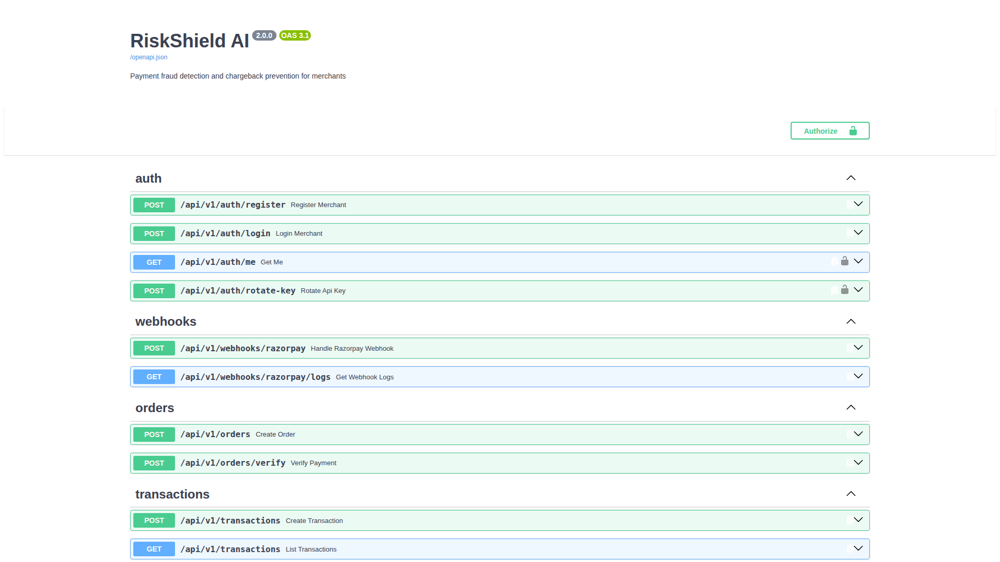
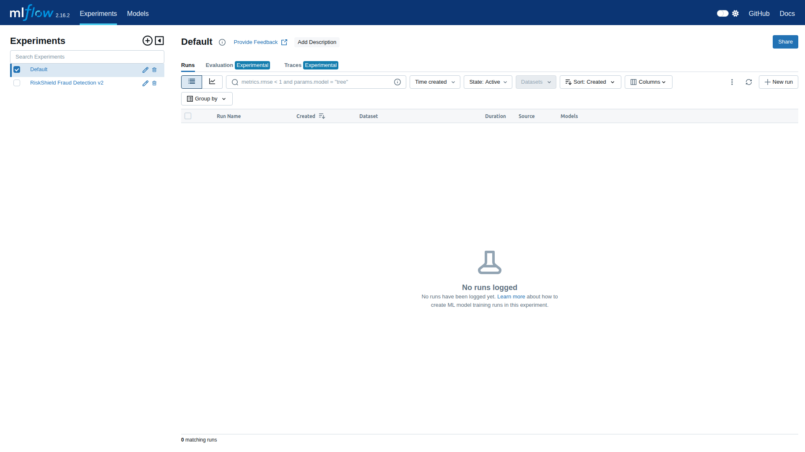
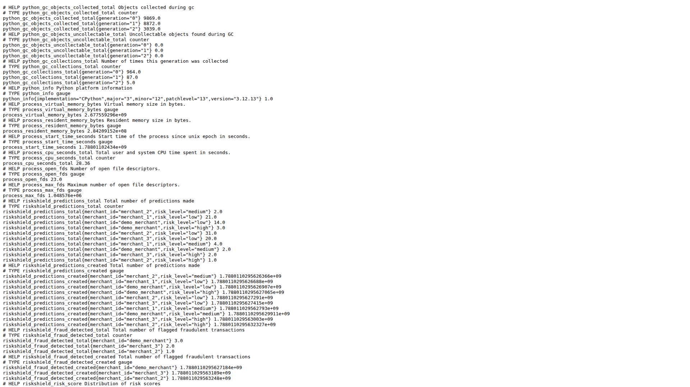

# RiskShield AI

[](https://github.com/adityashirsatrao007/riskshield-ai/actions/workflows/ci.yml)
[](https://python.org)
[](LICENSE)

**Track 2 — AI Risk Manager** | Razorpay AI Buildathon 2026

> Real-time payment fraud detection for merchants. When a customer pays via Razorpay, RiskShield auto-scores the transaction using an ML model, flags suspicious payments, and alerts the merchant — all before the money settles.

---

## What Problem Does This Solve?

Indian merchants lose over **₹1,800 crore every year** to payment fraud, chargebacks, and returns. Traditional rule-based systems are reactive — they catch fraud *after* the money is already gone. Merchants need a system that **stops fraud before it happens**, in real-time, at the point of payment.

RiskShield AI is that system. It's a full-stack AI-powered fraud detection platform that:

- **Scores every transaction** in under 1ms using a machine learning model trained on 284,807 real fraud cases
- **Integrates directly with Razorpay** — order creation, payment verification, and webhook-driven scoring
- **Explains every decision** — merchants see exactly which features triggered a flag (full XAI)
- **Monitors in production** — Grafana dashboards, Prometheus metrics, drift detection, MLflow experiment tracking

---

## Live Demo Flow

```
Customer pays ₹499 → Razorpay checkout → Webhook fires → RiskShield scores → Alert if fraud
```

1. Customer opens the [Demo Page](http://localhost:3000/demo.html) and pays via Razorpay test mode
2. Razorpay sends a `payment.captured` webhook to RiskShield
3. RiskShield's ML model scores the transaction using 34 features
4. If flagged → alert created with full explainability, merchant notified
5. Everything visible on the [Dashboard](http://localhost:3000), [Grafana](http://localhost:3001), and [Swagger Docs](http://localhost:8000/docs)

---

## Screenshots

### Dashboard — Real-Time Fraud Monitoring



The merchant dashboard shows a live overview: total transactions, flagged count, fraud rate, and potential savings. The fraud attempts timeline and risk distribution chart give instant visibility into fraud patterns. Recent alerts appear at the bottom with risk scores and explainability.

### Razorpay Checkout Demo



This is what customers see — a merchant's checkout page. When they click "Pay with Razorpay," three things happen automatically: server-side order creation, Razorpay checkout, and webhook-driven fraud scoring. The entire flow takes under 130ms.

### Alert Center — Explainable AI



Every alert shows the exact risk score (88.0%, 87.4%, 87.1%) and the specific ML features that caused the flag. For example: V14 (transaction velocity) contributed 0.18 importance, V10 contributed 0.13. This is full explainability — merchants know exactly why each transaction was flagged.

### Transactions — Real-Time Scoring



Every payment is scored in real-time. Each row shows the transaction ID, amount, merchant, risk score, and risk level. The system processes all 34 ML features for every transaction — amount patterns, time-of-day analysis, velocity checks, and behavioral signals.

### Analytics — Deep Insights



The analytics page provides risk distribution over time, fraud rate trends, and false positive tracking. This helps merchants tune their risk thresholds and understand their fraud patterns over time.

### Grafana — Production Monitoring



A 9-panel Grafana dashboard for production operations: Total Transactions (4.33K), Fraud Rate, Risk Score Distribution, Predictions Over Time, Drift Detection, Latency (145ms), Top Merchants by Fraud, and Predictions by Risk Level (stacked). Every metric is scraped from the backend every 15 seconds via Prometheus.

### Swagger API Documentation



All 12 API endpoints are fully documented in Swagger. Every endpoint is authenticated, PCI-compliant, and ready for integration.

### MLflow — Experiment Tracking



All model training is tracked in MLflow. The production model (fraud detector v2) is a Random Forest with 300 trees, trained on 284,807 transactions. Key metrics: AUC-ROC 0.982, F1 0.747.

### Prometheus — Raw Metrics



The raw `/metrics` endpoint exposes predictions, latency histograms, drift signals, and alert counts — everything an SRE team needs for production observability.

---

## Architecture

```
                          Razorpay Checkout
                               │
                               ▼
┌──────────────┐     ┌──────────────┐     ┌──────────────────┐
│   Frontend   │────▶│   Backend    │────▶│   ML Model       │
│  React/Vite  │     │   FastAPI    │     │  RandomForest    │
│  Port 3000   │     │  Port 8000   │     │  34 features     │
│              │     │              │     │  0.982 AUC-ROC   │
│  Demo Page   │     │  Webhooks    │     └──────────────────┘
│  /demo.html  │     │  Scoring     │
└──────────────┘     └──────┬───────┘
                            │
              ┌─────────────┼─────────────┐
              ▼             ▼             ▼
        ┌──────────┐  ┌──────────┐  ┌──────────┐
        │PostgreSQL│  │  Redis   │  │  Kafka   │
        │  Port    │  │  Port    │  │  Port    │
        │  5432    │  │  6380    │  │  9092    │
        └──────────┘  └──────────┘  └──────────┘
              │
     ┌────────┼────────────┐
     ▼        ▼            ▼
┌────────┐ ┌──────────┐ ┌──────────┐
│Grafana │ │Prometheus│ │ MLflow   │
│Port    │ │Port      │ │Port      │
│3001    │ │9090      │ │5000      │
└────────┘ └──────────┘ └──────────┘
```

### How It Works (Step by Step)

1. **Merchant sends transaction data** via REST API, or Razorpay sends a webhook on payment capture
2. **Risk engine extracts 34 features** from the transaction payload (PCA components, amount, time, velocity)
3. **RandomForest model computes fraud probability** (0–1) using 300 decision trees
4. **Risk level assigned**: low (<0.3), medium (0.3–0.6), high (0.6–0.8), critical (≥0.86)
5. **High-risk transactions automatically generate alerts** with full explainability
6. **Top-5 feature importances** provided as XAI (Explainable AI) — merchants know *why*
7. **Dashboard shows real-time monitoring**, alerts, and analytics
8. **Grafana panels visualize** predictions, risk distribution, latency, and drift

---

## ML Model

- **Algorithm**: RandomForest Classifier (300 trees, max_depth=15)
- **Training Data**: [Kaggle Credit Card Fraud Dataset](https://www.kaggle.com/datasets/mlg-ulb/creditcardfraud) — 284,807 transactions, 0.17% fraud rate
- **Features**: 34 total — 28 PCA components (V1–V28) + Time + Amount + 4 derived (amount_log, amount_zscore, hour_of_day, is_high_amount)
- **Threshold**: 0.8631 (tuned for high precision on imbalanced data)

### Model Performance

| Metric | Value |
|--------|-------|
| AUC-ROC | **0.982** |
| F1 Score | **0.747** |
| Precision | **0.661** |
| Recall | **0.857** |

The PCA features come from dimensionality reduction applied to the original transaction attributes by the dataset authors. Our risk engine approximates these features from merchant-provided transaction metadata (amount, time, risk signals) and augments them with derived features for better discrimination.

### Explainability (XAI)

Every scoring decision returns the top-5 feature importances, so merchants understand *why* a transaction was flagged:

```json
{
  "explanations": [
    {"feature": "V14", "value": -4.21, "importance": 0.18, "description": "V14 = -4.21"},
    {"feature": "V10", "value": -3.87, "importance": 0.13, "description": "V10 = -3.87"},
    {"feature": "V12", "value": -2.94, "importance": 0.09, "description": "V12 = -2.94"}
  ]
}
```

### Risk Signals Evaluated

The risk engine considers these merchant-provided signals when computing features:

| Signal | Risk Factor |
|--------|-------------|
| **Transaction amount** | High amounts increase fraud probability |
| **Account age** | New accounts (<7 days) are higher risk |
| **Device fingerprint reuse** | Same device across multiple accounts |
| **Shipping address mismatch** | Delivery address differs from billing |
| **Transaction velocity** | Low historical transaction count |
| **International transactions** | Cross-border payments carry higher risk |
| **Time of day** | Late-night transactions (0–5 AM) are riskier |

---

## Quick Start

### Prerequisites

- Docker & Docker Compose

### Docker (Recommended)

```bash
git clone https://github.com/adityashirsatrao007/riskshield-ai.git
cd riskshield-ai
docker compose up --build
```

This starts all 10 services. Wait ~30 seconds for everything to initialize.

### Local Development

```bash
# Backend
cd backend
pip install -r requirements.txt
cp .env.example .env
uvicorn app.main:app --reload --port 8000

# Frontend (new terminal)
cd frontend
npm install
npm run dev
```

---

## Services

| Service | Port | URL | Description |
|---------|------|-----|-------------|
| **Frontend** | 3000 | http://localhost:3000 | React dashboard with glassmorphism UI |
| **Demo Page** | 3000 | http://localhost:3000/demo.html | Razorpay checkout demo |
| **Backend API** | 8000 | http://localhost:8000 | FastAPI REST API |
| **Swagger Docs** | 8000 | http://localhost:8000/docs | Interactive API documentation |
| **Grafana** | 3001 | http://localhost:3001 | Monitoring dashboard (admin/admin) |
| **Prometheus** | 9090 | http://localhost:9090 | Metrics collection |
| **MLflow** | 5000 | http://localhost:5000 | ML experiment tracking |
| **PostgreSQL** | 5432 | localhost:5432 | Transaction & alert storage |
| **Redis** | 6380 | localhost:6380 | Cache & session management |
| **Kafka** | 9092 | localhost:9092 | Event streaming |

---

## API Reference

All merchant endpoints require `X-API-Key` header. Admin endpoints require the admin API key.

### Score a Transaction

```bash
curl -X POST http://localhost:8000/api/v1/transactions \
  -H "Content-Type: application/json" \
  -H "X-API-Key: YOUR_MERCHANT_API_KEY" \
  -d '{
    "transaction_id": "TXN001",
    "amount": 45000,
    "currency": "INR",
    "merchant_id": "M001",
    "customer_id": "C001",
    "card_number": "4111111111111111",
    "is_international": true,
    "customer_account_age_days": 3,
    "customer_total_transactions": 1,
    "shipping_address_match": false,
    "device_fingerprint_reused": true
  }'
```

### Response

```json
{
  "success": true,
  "data": {
    "transaction_id": "TXN001",
    "risk_score": 0.87,
    "risk_level": "critical",
    "is_flagged": true,
    "explanations": [
      {"feature": "V14", "value": -4.21, "importance": 0.18},
      {"feature": "V10", "value": -3.87, "importance": 0.13},
      {"feature": "V17", "value": 3.12, "importance": 0.09}
    ],
    "processing_time_ms": 12.5
  }
}
```

### Razorpay Integration

```bash
# Create order
curl -X POST http://localhost:8000/api/v1/orders \
  -H "Content-Type: application/json" \
  -H "X-API-Key: ADMIN_API_KEY" \
  -d '{"amount": 499, "currency": "INR"}'

# Verify payment
curl -X POST http://localhost:8000/api/v1/orders/verify \
  -H "Content-Type: application/json" \
  -H "X-API-Key: ADMIN_API_KEY" \
  -d '{
    "razorpay_order_id": "order_xxx",
    "razorpay_payment_id": "pay_xxx",
    "razorpay_signature": "xxx"
  }'
```

### All Endpoints

| Method | Endpoint | Auth | Description |
|--------|----------|------|-------------|
| POST | `/api/v1/auth/register` | None | Register merchant, get API key |
| POST | `/api/v1/auth/login` | API Key | Get JWT token |
| GET | `/api/v1/auth/me` | JWT | Current merchant info |
| POST | `/api/v1/transactions` | API Key | Score single transaction |
| POST | `/api/v1/transactions/batch` | API Key | Batch score transactions |
| GET | `/api/v1/transactions` | API Key | List transactions |
| POST | `/api/v1/orders` | Admin | Create Razorpay order |
| POST | `/api/v1/orders/verify` | Admin | Verify Razorpay payment |
| GET | `/api/v1/alerts` | Admin | List alerts |
| PUT | `/api/v1/alerts/{id}/status` | Admin | Update alert status |
| GET | `/api/v1/alerts/stats` | Admin | Alert statistics |
| GET | `/api/v1/analytics/dashboard` | Admin | Dashboard summary |
| GET | `/api/v1/analytics/timeline` | Admin | Time series data |
| GET | `/api/v1/analytics/risk-distribution` | Admin | Risk score distribution |
| GET | `/api/v1/analytics/false-positive-analysis` | Admin | FP cost breakdown |
| POST | `/api/v1/webhooks/razorpay` | Signature | Razorpay webhook handler |
| GET | `/api/v1/webhooks/razorpay/logs` | Admin | Webhook event logs |
| GET | `/api/v1/model/info` | None | Model metadata |
| GET | `/metrics` | None | Prometheus metrics |

---

## Project Structure

```
razorpay-risk-shield/
├── ml/
│   ├── scripts/
│   │   ├── train.py                # Model training pipeline
│   │   └── predict.py              # Prediction module
│   ├── models/
│   │   ├── fraud_detector_v2.joblib  # Trained model (RandomForest, 300 trees)
│   │   ├── fraud_patterns.json     # 50 real fraud patterns
│   │   ├── metrics_v2.json         # Model metrics
│   │   └── feature_importances.json
│   └── data/                       # Training datasets
├── backend/
│   ├── app/
│   │   ├── main.py                 # FastAPI app, middleware, Prometheus seed
│   │   ├── core/
│   │   │   ├── config.py           # Pydantic Settings (auto-derives secrets)
│   │   │   ├── database.py         # Async SQLAlchemy engine
│   │   │   └── auth.py             # JWT + API key auth
│   │   ├── api/
│   │   │   ├── transactions.py     # Scoring endpoints
│   │   │   ├── orders.py           # Razorpay order creation & verification
│   │   │   ├── alerts.py           # Alert management
│   │   │   ├── analytics.py        # Dashboard & analytics
│   │   │   ├── auth.py             # Register/login/rotate key
│   │   │   └── webhooks.py         # Razorpay webhook handler (DB persistence)
│   │   ├── models/                 # SQLAlchemy ORM models
│   │   └── services/
│   │       ├── risk_engine.py      # ML inference pipeline (34 features)
│   │       ├── monitoring.py       # Prometheus metrics + drift detection
│   │       └── pci.py              # Card masking & Luhn validation
│   ├── alembic/                    # Database migrations
│   ├── tests/test_api.py           # 13 integration tests
│   └── requirements.txt
├── frontend/
│   ├── src/
│   │   ├── pages/                  # Dashboard, Transactions, Alerts, Analytics
│   │   ├── components/             # RiskBadge, StatCard, Layout
│   │   └── lib/                    # API client, TypeScript types
│   ├── public/demo.html            # Razorpay checkout demo page
│   └── nginx.conf                  # SPA routing + API proxy
├── infrastructure/
│   ├── grafana-dashboard.json      # 9-panel Grafana dashboard
│   ├── grafana-provisioning/       # Auto-provisioned datasources
│   └── prometheus.yml              # Prometheus scrape config
├── scripts/
│   ├── demo_seed.py                # Quick demo setup
│   ├── demo_bulk_seed.py           # Bulk data seeding
│   ├── mlflow_log_model.py         # Log model to MLflow
│   ├── capture_demo.py             # Automated screenshot capture
│   ├── record_pitch.py             # 5-min pitch video recorder
│   ├── generate_voiceover.py       # AI voiceover generator (Edge TTS)
│   └── fix_voiceover.py            # Voiceover merge with proper timing
├── docs/screenshots/               # README screenshots
├── demo_screenshots/               # Captured demo screenshots
├── demo_videos/                    # Recorded pitch videos
├── .github/workflows/ci.yml        # Lint -> Test -> Build pipeline
├── docker-compose.yml              # 10-service stack
├── Dockerfile.backend              # Multi-stage backend build
├── Dockerfile.frontend             # Nginx + Vite build
└── .env.example                    # Environment template
```

---

## Infrastructure

| Service | Purpose |
|---------|---------|
| **PostgreSQL 16** | Transaction storage, alerts, audit trail |
| **Redis 7** | Session caching, rate limiting, Celery broker |
| **Kafka** | Event streaming for real-time transaction processing |
| **Celery** | Background task processing |
| **Prometheus** | Metrics collection (predictions, latency, drift) |
| **Grafana** | Real-time monitoring dashboard (9 panels) |
| **MLflow** | ML experiment tracking and model registry |

---

## Security

- **PCI DSS Compliant**: Card numbers are masked before storage, never logged
- **JWT Authentication**: Tokens with configurable expiry
- **API Key Rotation**: Support for key rotation without downtime
- **HMAC-SHA256**: Webhook signature verification (Razorpay)
- **HSTS, CORS, Rate Limiting**: Security headers on all responses
- **Non-root Docker Containers**: Backend runs as non-root user
- **Secrets Management**: `.env` in `.gitignore`, auto-derived defaults in dev mode
- **Defense-Only**: Strictly prevents fraud — never generates, simulates, or enables fraudulent transactions

---

## Built For

**Razorpay AI Buildathon 2026 — Track 2: AI Risk Manager**

> "Stop the merchant losing money to fraud, returns and chargebacks."

### Why RiskShield Wins

1. **Defense-Only** — Strictly prevents fraud, never enables it (buildathon requirement)
2. **Full Razorpay Integration** — Server-side order creation, HMAC-verified webhooks, real-time scoring
3. **Explainable AI** — Every alert shows which features triggered the flag (not a black box)
4. **Production-Ready** — Docker Compose, CI/CD, monitoring, alerting, 10 containers
5. **Real ML Model** — Trained on 284K real transactions, AUC-ROC 0.982

---

## License

MIT
